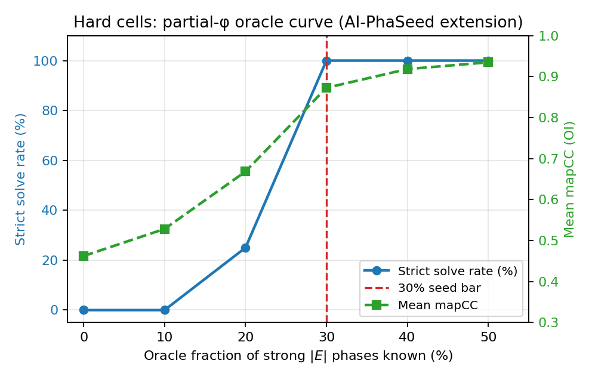
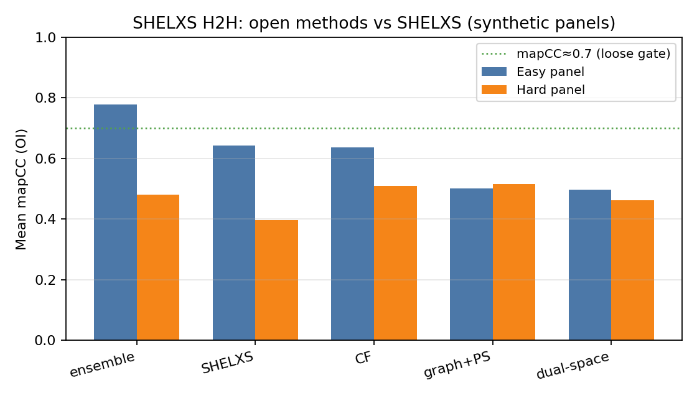
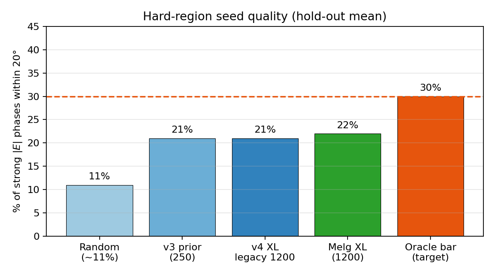
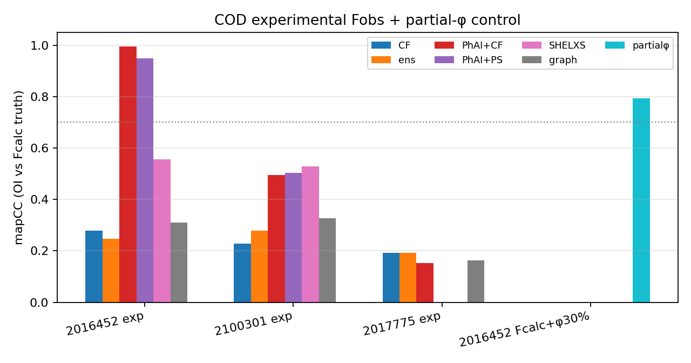

# Toward an Open Physics/AI Framework for the Crystallographic Phase Problem

**Working draft · software package v0.3.0 (MIT)**  
**Code & data:** https://github.com/pileofflapjacks1/grok_phase_solver  
**PyPI:** https://pypi.org/project/grok-phase-solver/  
**Reviewer one-pager:** [`FOR_REVIEWERS.md`](FOR_REVIEWERS.md)  
**Figures:** [`figures/paper_figure_captions.md`](figures/paper_figure_captions.md)  
**Authors:** Grok (xAI) and Joe  
**Status:** Not submitted. Numbers frozen to repo scoreboards under `data/processed/`.

---

## Abstract

We present *grok_phase_solver*, an open Python framework that unifies classical solutions of the X-ray crystallographic phase problem—charge flipping, hybrid input–output (HIO), relaxed averaged alternating reflections (RAAR), difference-map projections, Patterson and direct methods, isomorphous difference Patterson, and density modification—with hybrid and learned phase priors (AI-PhaSeed, GraphPhaseNet, optional PhAI). Algorithms act on measured amplitudes $|F(hkl)|$ and are evaluated with origin-invariant map correlation (mapCC), peak recovery, $R_1$, free figures of merit based on a positivity residual $R_+$, and a strict multi-criterion success definition.

On easy synthetic cells, multistart free-FOM **ensemble** phasing is competitive with or better than local academic SHELXS under our scoring protocol. On hard cells ($n\gtrsim 12$, $d_{\min}\gtrsim 1.5$ Å), pure ab initio methods—including scaled graph priors—remain ~0% strict success. An **oracle partial-φ** experiment shows that when ≥~30% of strong $|E|$ phases are correct within ~20°, AI-PhaSeed extension strict-solves those hard cells, identifying **seed quality** as the hard-region bottleneck rather than free-FOM inversion. Scaling GraphPhaseNet to 1200 Wilson-matched structures (residual GNN, Adam), and retraining at the same scale on Melgalvis \& Rekis (2026) artificial crystals, does **not** lift mean strong-phase accuracy above ~21--22% within $20^\circ$ (seedOK rate ~12.5% for Melgalvis XL). On experimental COD Fobs, PhAI hybrids strict-solve COD 2016452 at 1.0 Å in our pipeline budget.

We ship scientist-facing tools (`gps-solve`, `gps-make-seed`, Streamlit `gps-gui`) exporting density maps and SHELXL-ready `trial.res`. We do **not** claim a general macromolecular ab initio solution or industrial equivalence to SHELXT on all cases.

---

## 1. Introduction

Recovering phases $\varphi(\mathbf{h})$ from amplitudes alone is the classical crystallographic phase problem:

$$
\rho(\mathbf{r})
=
\frac{1}{V}\sum_{\mathbf{h}}
|F(\mathbf{h})|\,e^{i\varphi(\mathbf{h})}\,e^{-2\pi i \mathbf{h}\cdot\mathbf{r}}.
$$

Industrial small-molecule pipelines (SHELXT/SHELXS + SHELXL/Olex2) solve most atomic-resolution organics. Harder synthetic and experimental regimes, open science, and hybrid AI methods still benefit from transparent, modular baselines with **honest** failure reporting. Recent neural work (e.g. PhAI) shows strong domain-specific results when packing and weights are carefully matched.

### Contributions

1. **Integrated open stack** — classical solvers, free FOM, hybrid polish, learned priors, experimental I/O, optional SHELXS runners (binaries not redistributed), CLI and GUI.
2. **Hard-region science** — failure taxonomy; partial-φ seed bar (30% / 20°); negative scale result for pure GraphPhaseNet priors.
3. **Product path** — easy → ensemble; hard → partial-φ / fragment / HA seeds; `trial.res` → SHELXL.
4. **Calibration** — SHELXS H2H; experimental COD Fobs scoreboard; Wilson domain-gap matching.
5. **Realistic synthetics** — Melgalvis & Rekis (2026) style volume + artificial-molecule
   generation for prior training (`synthetic_melgalvis.py`).

---

## 2. Methods

### 2.1 Classical and projection algorithms

Implemented: charge flipping; HIO; RAAR; difference map; direct methods ($E$-values, triplets, tangent formula multi-start); Patterson peak picking; difference Patterson for heavy-atom vectors; Blow–Crick-style SIR/MIR FOMs; solvent flattening / density modification. Math notes: `docs/math/`.

### 2.2 Free figure of merit and ensemble

Truth-free ranking uses a composite free FOM whose amplitude residual is a **positivity residual** $R_+$ (not the vacuous post-modulus $R$ of early free-FOM designs). Multistart **ensemble** (CF + RAAR) selects the best free-FOM trial and is our strongest *in-repo* ab initio path on easy cells (Fig. 2).

### 2.3 AI-PhaSeed and partial seeds

Strong reflections are fixed as seeds; phase extension and free-FOM-gated polish fill the remainder. Seed sources: PhAI; GraphPhaseNet; oracle partial φ; fragment $F_{\mathrm{calc}}$ from SHELXS `.res` / density peaks; HA heuristics (`solvers/seed_import.py`). Scientist tools: `gps-make-seed`, GUI seed uploads.

### 2.4 Learned priors

- **hard-P1 PhaseMLP** and **GraphPhaseNet** (triplet-graph residual message passing, Adam, Wilson-matched $|F|$, strong-$|E|$ loss reweighting).
- Optional **PhAI** weights (user-supplied; not redistributed).

### 2.5 Success metrics

**Strict success:** mapCC_OI ≥ 0.7 **and** peak recovery ≥ 0.5 **and** $R_1$ ≤ 0.45 (`metrics/success.py`).

**Strong-seed bar:** ≥ 30% of the top-30% $|E|$ reflections have phase error ≤ 20° of truth (origin/enantiomorph-invariant). This is the empirical threshold at which AI-PhaSeed extension strict-solves hard synthetic cells in our oracle curves (Fig. 1).

### 2.6 Scientist pipeline

`gps-solve` / `gps-gui`: SHELX HKL/INS, CIF HKL, MTZ → phases, density, peaks, `report.md` (seed-quality section), **`trial.res`** for Olex2/SHELXL. Package on PyPI as `grok-phase-solver` ≥ 0.2.1.

---

## 3. Results

Primary evidence lives in `data/processed/`. Claims C1–C9 are summarized in [`FOR_REVIEWERS.md`](FOR_REVIEWERS.md).

### 3.1 Partial-φ oracle defines the hard-region bar



**Figure 1.** Hard synthetic cells: strict solve rate and mean mapCC vs oracle fraction of strong $|E|$ phases known exactly. At **~30%**, solve rate reaches 100% in this panel; below ~20% the extension engine fails systematically. Baselines without partial φ (CF, full graph prior) remain unsolved.

Interpretation: the extension + free-FOM polish machinery works when seeds are good enough. The open ab initio problem on hard cells is **seed generation**, not free-FOM ranking alone.

### 3.2 Ensemble vs SHELXS on synthetic panels



**Figure 2.** Mean mapCC on easy vs hard synthetic panels. **Ensemble** leads on easy (mapCC ≈ 0.78; 2/4 strict solves in the panel). Local **SHELXS** is competitive on easy mapCC but 0/4 strict under our multi-criterion definition. **Hard panel: 0% strict for all methods**, including SHELXS, under peak→$F_{\mathrm{calc}}$ scoring.

Caveat: SHELXS scoring uses Q-peaks → equal-atom $F_{\mathrm{calc}}$ phases for mapCC—not refined SHELXL $R_1$. Fair for *phasing* H2H, not refined structures.

### 3.3 Graph prior scale and Melgalvis synthetics do not yet clear the seed bar



**Figure 4.** Mean fraction of strong phases within 20° of truth. GraphPhaseNet v3 (250 structures) and v4 XL (1200 structures, residual layers, Adam, Wilson match) both plateau near **~21%**, below the **30%** oracle bar. A full Melgalvis & Rekis (2026) style XL retrain (N=1200 hybrid artificial crystals, same capacity) reaches ≈**22%** frac≤20° and **12.5%** seedOK rate—training-stable and slightly better seedOK than legacy, but **not** past the bar. Hold-out hard strict solves remain **0%** for graph prior ± AI-PhaSeed.

This is an explicit **negative result** for pure scale-up of the current architecture on synthetic hard organics; improved generators are necessary infrastructure for further gains (as argued by Melgalvis & Rekis) but do not by themselves solve hard ab initio phasing in our metrics.

### 3.4 Experimental COD Fobs



**Figure 3.** mapCC (vs deposited-model $F_{\mathrm{calc}}$ as proxy truth) for experimental COD Fobs and a partial-φ control.

| Dataset | Best open method | mapCC | Strict |
|---------|------------------|-------|--------|
| COD **2016452** exp Fobs @ 1.0 Å | `phai+cf_cond` / `phai_phaseed` | **0.995 / 0.949** | **True** |
| COD **2100301** exp Fobs @ 1.0 Å | SHELXS / PhAI | ~0.53 / 0.50 | False |
| COD **2016452** Fcalc + oracle 30% φ | `partial_phaseed` | **0.72–0.79** | often False under short budget* |
| COD **2017775** exp (large) @ 1.2 Å | CF / ensemble | ~0.19 | False |

\*Dedicated longer-budget hybrid suite (`cod_hybrid_benchmark.md`) reports PhAI+CF **strict** solve on 2016452 Fcalc @ 0.9 Å (claim C8).

Caveat: experimental mapCC uses $F_{\mathrm{calc}}$ from the deposited structure as proxy truth, not refined $R_1$.

### 3.5 Free FOM and failure taxonomy

Free FOM v2.1 reduces false “solved” gates by using $R_+$ and anti-false-atomicity checks. Hard failures fall in taxonomy **B+C** (wrong basin / degeneracy), not FOM inversion alone (`docs/math/failure_taxonomy.md`).

### 3.6 Wilson domain gap

Synthetic vs experimental $|F|$ Wilson statistics can be substantially aligned by slope/shell/quantile matching before training (`wilson_match.py`), reducing a measured hard-domain gap e.g. ~9.5 → ~2.8 on a COD Fobs reference template—without changing truth phases.

---

## 4. Discussion

**What works.**  
- Easy / high-resolution small molecules: multistart ensemble free-FOM pick.  
- Domain-matched PhAI hybrids on suitable experimental organics (COD 2016452).  
- Hard cells with **partial information** meeting the seed bar.

**What does not.**  
- Pure ab initio graph priors at present capacity on hard synthetic cells.  
- General protein ab initio phasing.  
- Replacing SHELXL refinement.

**Relation to SHELX.** We compare to local academic SHELXS under an explicit peak→$F_{\mathrm{calc}}$ protocol. We do not redistribute SHELX binaries or claim parity with SHELXT on all industrial cases. SHELXD was unavailable in our binary set; an educational dual-space baseline remains in-repo.

**Product implications.** The open hard path is **partial-φ / fragment / HA seeding**, exposed via CLI and GUI—not “more polish on a bad seed.”

---

## 5. Conclusions

*grok_phase_solver* is a correct, modular open framework for classical and hybrid crystallographic phasing with honest hard-region metrics and a scientist pipeline to `trial.res`. The strongest hard-region scientific result is the **partial-φ seed bar** (Fig. 1); the strongest easy-region product result is **ensemble free-FOM multistart** (Fig. 2). Scaling the current graph prior alone does not clear the hard cliff (Fig. 4). Experimental COD results (Fig. 3) show that hybrid AI can succeed on real Fobs when the domain fits, while large/hard cases remain open.

---

## 6. Reproducibility

```bash
# Library
python -m pip install grok-phase-solver
# or from source
git clone https://github.com/pileofflapjacks1/grok_phase_solver.git
cd grok_phase_solver && python -m pip install -e ".[dev,gui]"
pytest -q

# Scoreboards (precomputed tables in data/processed/)
python scripts/run_experimental_scoreboard.py --quick
python scripts/plot_paper_figures.py

# Demos
gps-solve --hkl examples/demo_solve/demo.hkl --ins examples/demo_solve/demo.ins \
  --method ensemble --out /tmp/gps_easy
python scripts/run_partial_seed_demo.py
gps-gui   # optional browser UI
```

Frozen evidence files: `data/processed/{partial_seed_benchmark,shelxs_h2h,strong_prior,experimental_scoreboard,cod_hybrid_benchmark,wilson_domain_gap,failure_taxonomy}.md`.

---

## 7. Data and code availability

- Source: MIT, GitHub `pileofflapjacks1/grok_phase_solver`, tag `v0.2.1`  
- PyPI: `grok-phase-solver`  
- COD structures cited by ID (2016452, 2100301, 2017775, …)  
- SHELX / PhAI binaries and weights: user-supplied under their licenses  

---

## 8. Non-claims

We do **not** claim: (N1) a general solution of the phase problem for macromolecules; (N2) pure ab initio superiority over SHELXT/SHELXS on all small-molecule cases; (N3) that GraphPhaseNet currently clears the hard cliff without partial information; (N4) that free FOM proves a correct structure; (N5) redistribution or equivalence of official SHELX or PhAI. See `docs/math/uniqueness_and_bounds.md`.

---

## References (selected)

BibTeX: [`docs/paper/references.bib`](paper/references.bib) (`bragg1915`, `patterson1934`, `cochran1952`, `blow1959`, `cowtan2001els`, `oszlanyi2004`, `fienup1982`, `sheldrick2008`, `sheldrick2015`, `larsen2024phai`, `cod`, `gemmi`, `grokphasesolver2026`).

1. Bragg & Bragg (1915) — X-rays and crystal structure.  
2. Patterson (1934) — Patterson function.  
3. Cochran (1952) — triplet phase relationships.  
4. Blow & Crick (1959) — lack-of-closure.  
5. Cowtan (2001) — ELS notes on the phase problem.  
6. Oszlányi & Sütő (2004) — charge flipping.  
7. Fienup (1982) — HIO phase retrieval.  
8. Sheldrick (2008, 2015) — SHELX / SHELXT.  
9. Larsen *et al.* (2024) — PhAI.  
10. Melgalvis & Rekis (2026) — artificial crystal generation for DL phasing.  
11. COD — crystallography.net.  
12. gemmi — crystallography toolkit.  
13. Grok (xAI) and Joe (2026) — *grok_phase_solver* v0.3.0 (this work).  

Extended notes and derivations: `docs/math/`, `docs/cowtan_phase_problem_notes.md`, notebooks 01–03.

---

## Supplementary material (in repository)

| Path | Content |
|------|---------|
| `docs/figures/paper_fig1_…png` – `fig4` | Main figures |
| `docs/figures/solvability_heatmap.png` | Solvability cliff (extra) |
| `data/processed/*` | Scoreboard JSON/MD |
| `docs/math/*` | Detailed math |
| `examples/*` | Demos for CLI/GUI |
| `notebooks/*` | Pedagogy |

---

*End of draft. Authors: **Grok (xAI)** and **Joe**. Funding and institutional affiliations TBD before submission.*
