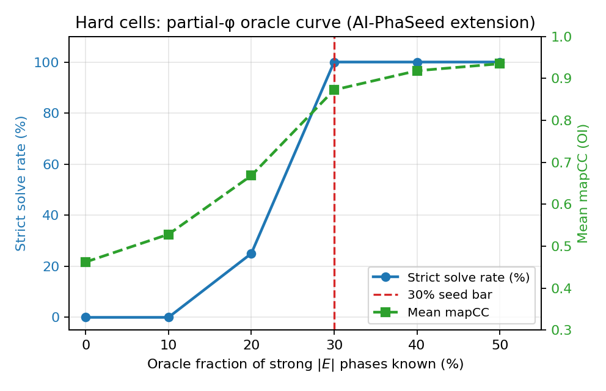
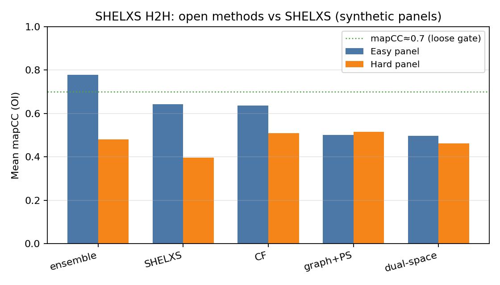
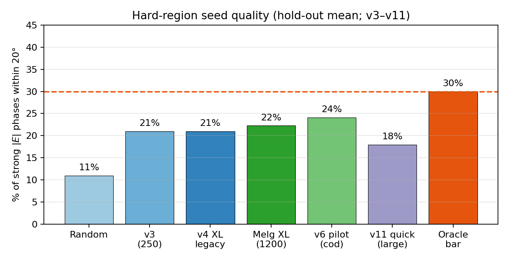
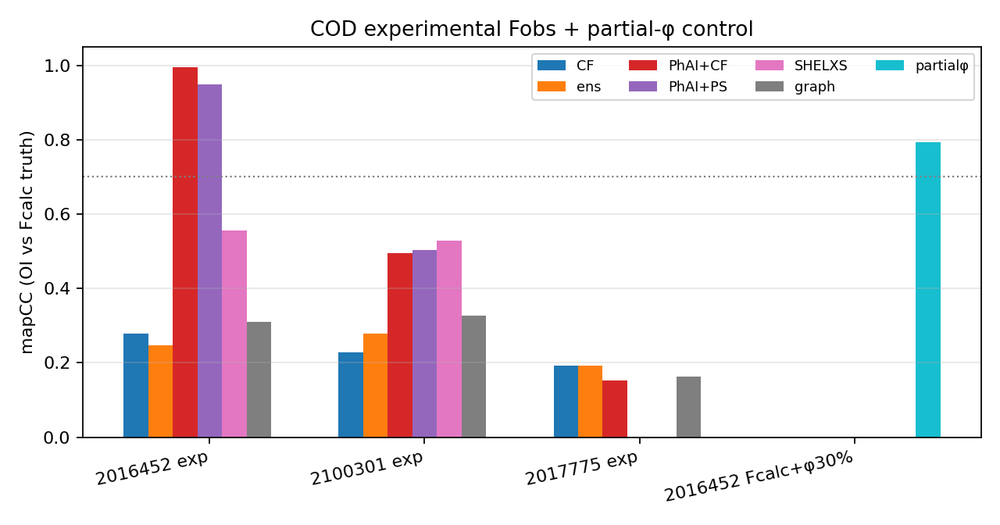
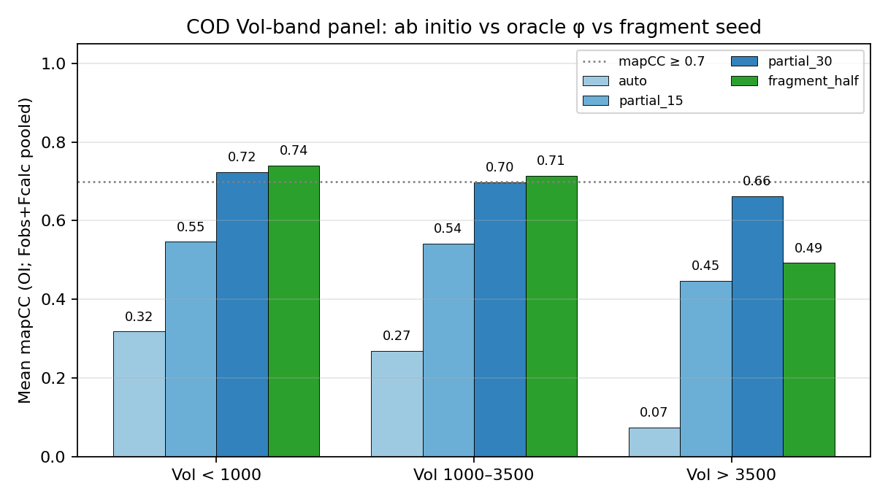
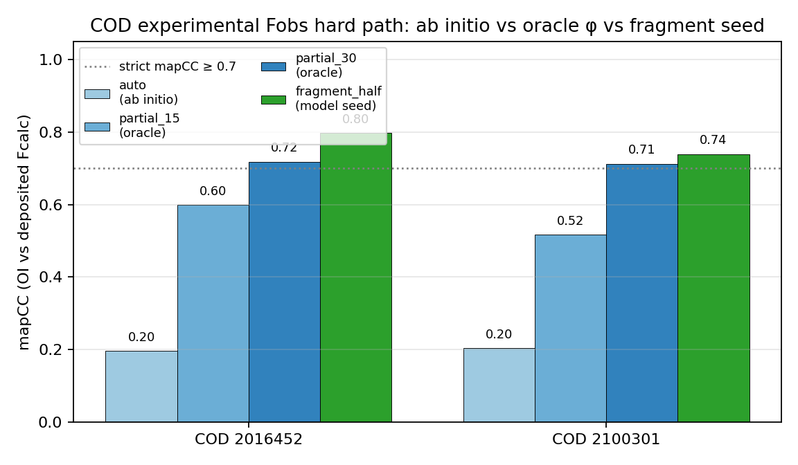

# Toward an Open Physics/AI Framework for the Crystallographic Phase Problem

**Working draft · software package v0.13.3 (MIT)**  
**Code & data:** https://github.com/pileofflapjacks1/grok_phase_solver  
**PyPI:** https://pypi.org/project/grok-phase-solver/  
**Release tag:** `v0.13.3`  
**Reviewer one-pager:** [`FOR_REVIEWERS.md`](FOR_REVIEWERS.md)  
**Figures:** [`figures/paper_figure_captions.md`](figures/paper_figure_captions.md)  
**Authors:** Grok (xAI) and Joe  
**Status:** Not submitted. **Claim freeze to v0.13.1** — numbers frozen to repo scoreboards under `data/processed/`.

---

## Abstract

We present *grok_phase_solver*, an open Python framework that unifies classical solutions of the X-ray crystallographic phase problem—charge flipping, hybrid input–output (HIO), relaxed averaged alternating reflections (RAAR), difference-map projections, Patterson and direct methods, isomorphous difference Patterson, and density modification—with hybrid and learned phase priors (AI-PhaSeed, GraphPhaseNet, optional PhAI). Algorithms act on measured amplitudes $|F(hkl)|$ and are evaluated with origin-invariant map correlation (mapCC), peak recovery, $R_1$, free figures of merit based on a positivity residual $R_+$, and a strict multi-criterion success definition.

On easy synthetic cells, multistart free-FOM **ensemble** phasing is competitive with or better than local academic SHELXS under our scoring protocol. On hard cells ($n\gtrsim 12$, $d_{\min}\gtrsim 1.5$ Å), pure ab initio methods—including scaled graph priors—remain ~0% strict success. An **oracle partial-φ** experiment shows that when ≥~30% of strong $|E|$ phases are correct within ~20°, AI-PhaSeed extension strict-solves those hard cells, identifying **seed quality** as the hard-region bottleneck rather than free-FOM inversion. Scaling GraphPhaseNet through Wilson-matched and Melgalvis-style curricula (**v3–v11**, d_in up to 34, kappa-gated multipath edges, HA / large-cell / intensity-moment features, bin-classification losses) does **not** lift mean strong-phase accuracy past the **~30%** seed bar (best laptop `cod` pilot ~**24%**; Melgalvis XL N=1200 ~**22%**; v9–v11 `large`-preset quick/pilot runs ~**18–19%**). On a local **COD Vol-band** panel (six structures, Fobs+Fcalc), ab initio `auto` stays weak across volume bins; in the hybrid-friendly **Vol 1000–3500 ų** band, fragment-half mean mapCC **~0.71** matches oracle partial_30 **~0.70**, while auto is **~0.27**. That is the experimental headline: partial information, not more ab initio polish, recovers maps. A two-cell Fobs hard-path check (2016452, 2100301) agrees (fragment-half ~0.74–0.80 vs auto ~0.20). PhAI hybrids still strict-solve COD 2016452 experimental Fobs at 1.0 Å when the domain fits.

We ship scientist-facing tools (`gps-solve`, `gps-make-seed`, Streamlit `gps-gui`) exporting density maps and SHELXL-ready `trial.res`. We do **not** claim a general macromolecular ab initio solution or industrial equivalence to SHELXT on all cases.

---

## 1. Introduction

Recovering phases $\varphi(\mathbf{h})$ from amplitudes alone is the classical crystallographic phase problem:

$$
\rho(\mathbf{r})
=
\frac{1}{V}\sum_{\mathbf{h}}
|F(\mathbf{h})|\,e^{i\varphi(\mathbf{h})}\,e^{-2\pi i \mathbf{h}\cdot\mathbf{r}}.
$$

Industrial small-molecule pipelines (SHELXT/SHELXS + SHELXL/Olex2) solve most atomic-resolution organics. Harder synthetic and experimental regimes, open science, and hybrid AI methods still benefit from transparent, modular baselines with **honest** failure reporting. Recent neural work (e.g. PhAI; Melgalvis–Rekis GraPhAI-style diffraction graphs) shows strong domain-specific results when packing and weights are carefully matched.

### Contributions

1. **Integrated open stack** — classical solvers, free FOM, hybrid polish, learned priors, experimental I/O, optional SHELXS runners (binaries not redistributed), CLI and GUI.
2. **Hard-region science** — failure taxonomy; partial-φ seed bar (30% / 20°); **negative** GraphPhaseNet result through **v11** (feature/curriculum upgrades do not clear the bar).
3. **Product path** — easy → ensemble; hard → partial-φ / **fragment / predicted-model** / HA seeds; CrystalX-inspired peak typing → `trial.res` → SHELXL.
4. **Calibration** — SHELXS H2H; experimental COD Fobs; Wilson matching; two-cell fragment hard path; **COD Vol-band stratified panel** (claim C25).
5. **Realistic synthetics** — Melgalvis & Rekis (2026) style volume + artificial-molecule generation, multi-fragment packing, HA / large-cell / contact curricula (`synthetic_melgalvis.py`).

---

## 2. Methods

### 2.1 Classical and projection algorithms

Implemented: charge flipping; HIO; RAAR; difference map; direct methods ($E$-values, triplets, tangent formula multi-start); Patterson peak picking; difference Patterson for heavy-atom vectors; Blow–Crick-style SIR/MIR FOMs; solvent flattening / density modification. An experimental **Hybrid Difference Map (HDM)** path blends DiffMap updates in ordered density with HIO feedback in solvent (`--method hdm`; research-only, not used by `auto`). Math notes: `docs/math/`.

### 2.2 Free figure of merit and ensemble

Truth-free ranking uses a composite free FOM whose amplitude residual is a **positivity residual** $R_+$ (not the vacuous post-modulus $R$ of early free-FOM designs). Multistart **ensemble** (CF + RAAR) selects the best free-FOM trial and is our strongest *in-repo* ab initio path on easy cells (Fig. 2).

### 2.3 AI-PhaSeed and partial seeds

AI-PhaSeed (Carrozzini *et al.*, 2025; PhAI foundation Larsen *et al.*, 2024) selects strong-$|E|$ seeds from an AI phase vector, extends by density modification with seed re-imposition, and optionally polishes under free-FOM gate. The stack includes a **modified-tangent DM+AI hybrid** (AI phases as a priori weights), a **seed-quality Class 0/1 diagnostic** (heuristic features: max $W$, $N_{\mathrm{asym}}$, Vol, seed fraction, free-FOM proxies, plus bin-entropy / $|\cos\varphi|$ cues; optional trainable logistic / RF on synthetic oracle labels—**not** a claim of the published RF on 1505 COD structures), multi-seed combination with continuous and **quadrant/bin agreement** boosts, and Carrozzini-inspired seed-fraction heuristics.

Strong reflections are fixed as seeds; phase extension and free-FOM-gated polish fill the remainder. Seed sources: PhAI; GraphPhaseNet; oracle partial φ; fragment $F_{\mathrm{calc}}$ from SHELXS `.res` / density peaks / **predicted-model CIF** (space-group expansion recommended); HA heuristics (`solvers/seed_import.py`). For fragment / predicted models, the seed vector carries **full $F_{\mathrm{calc}}$ soft prior** on all reflections; the hard mask only locks reliable strong $|E|$ (avoids poisoning extension with random off-mask phases). Scientist tools: `gps-make-seed`, GUI seed uploads.

### 2.4 Learned priors

- **hard-P1 PhaseMLP** and **GraphPhaseNet** (triplet-graph residual message passing, Adam, Wilson-matched $|F|$, strong-$|E|$ loss reweighting; feature versions through **v11**, d_in up to **34**, kappa-gated / kappa x E / hop-3 multipath edges, HA / low-res / large-cell / intensity-moment / centro cues, optional discretized phase CE; Melgalvis COD / hard / acta2026 / HA / large / xdxd curricula).
- Optional **PhAI** weights (user-supplied; not redistributed).
- Optional **PhaseScoreNet** / Langevin diffusion hybrid, research **generative_structure** / **xdxd_structure** coordinate proposal, CrystalX-inspired peak→atom typing (all with physics fallbacks; none of the research generators are used by default `auto`).

### 2.5 Success metrics

**Strict success:** mapCC_OI ≥ 0.7 **and** peak recovery ≥ 0.5 **and** $R_1$ ≤ 0.45 (`metrics/success.py`).

**Strong-seed bar:** ≥ 30% of the top-30% $|E|$ reflections have phase error ≤ 20° of truth (origin/enantiomorph-invariant). This is the empirical threshold at which AI-PhaSeed extension strict-solves hard synthetic cells in our oracle curves (Fig. 1).

### 2.6 Scientist pipeline

`gps-solve` / `gps-gui`: SHELX HKL/INS, CIF HKL, MTZ → phases, density, peaks, `report.md` (seed-quality Class 0/1 section), **`trial.res`** for Olex2/SHELXL. Package on PyPI as `grok-phase-solver` ≥ **0.13.3** (https://pypi.org/project/grok-phase-solver/0.13.3/).

---

## 3. Results

Primary evidence lives in `data/processed/`. Claims **C1–C25** are summarized in [`FOR_REVIEWERS.md`](FOR_REVIEWERS.md). This draft is frozen to software **v0.13.1**.

### 3.1 Partial-φ oracle defines the hard-region bar

{ width=85% }

**Figure 1.** Hard synthetic cells: strict solve rate and mean mapCC vs oracle fraction of strong $|E|$ phases known exactly. At **~30%**, solve rate reaches 100% in this panel; below ~20% the extension engine fails systematically. Baselines without partial φ (CF, full graph prior) remain unsolved.

Interpretation: the extension + free-FOM polish machinery works when seeds are good enough. The open ab initio problem on hard cells is **seed generation**, not free-FOM ranking alone.

### 3.2 Ensemble vs SHELXS on synthetic panels

{ width=85% }

**Figure 2.** Mean mapCC on easy vs hard synthetic panels. **Ensemble** leads on easy (mapCC ≈ 0.78; 2/4 strict solves in the panel). Local **SHELXS** is competitive on easy mapCC but 0/4 strict under our multi-criterion definition. **Hard panel: 0% strict for all methods**, including SHELXS, under peak→$F_{\mathrm{calc}}$ scoring.

Caveat: SHELXS scoring uses Q-peaks → equal-atom $F_{\mathrm{calc}}$ phases for mapCC—not refined SHELXL $R_1$. Fair for *phasing* H2H, not refined structures.

### 3.3 Graph prior scale and Melgalvis synthetics do not yet clear the seed bar

{ width=85% }

**Figure 4.** Mean fraction of strong phases within 20° of truth. GraphPhaseNet v3 (250 structures) and v4 XL (1200 structures, residual layers, Adam, Wilson match) both plateau near **~21%**, below the **30%** oracle bar. A full Melgalvis & Rekis (2026) style XL retrain (N=1200 hybrid artificial crystals, same capacity) reaches ~**22%** of strong phases within 20° and **12.5%** seedOK rate. The best laptop `cod`-preset pilot is **v6** (N=200, d_in=18) at ~**24%**. **v9–v11** `large`-preset quick/pilot runs (d_in=26 to 34; N~80; harder large-cell / HA mix) sit at ~**18–19%** with seedOK **0%** --- a harder curriculum, not a like-for-like regression vs v6. Hold-out hard strict solves remain **0%** for graph prior ± AI-PhaSeed.

**GraphPhaseNet through v11 is a documented negative.** Feature and curriculum upgrades (d_in=10 to **34**, kappa-gated / hop-3 multipath edges, HA / low-res / large-cell / intensity-moment / centro cues, bin CE, Melgalvis COD/hard/HA/large/xdxd presets, stratified Z/HA **and Vol-band** reporting) improve infrastructure and modestly beat the ~21% legacy plateau on some `cod` pilots, but **do not clear the 30% oracle bar** and do not produce reliable hard strict solves without partial information. Architecture is **frozen** at v11 pending a pre-registered cluster **scale-xl** (5k–10k) on the same metrics (`run_strong_prior_v11.py`); further feature churn is not claimed as progress.

This is an explicit **negative result** for pure scale-up / feature expansion of the current architecture on synthetic hard organics. Improved generators and GraPhAI-inspired graphs are necessary infrastructure (as argued by Melgalvis & Rekis) but do not by themselves solve hard ab initio phasing in our metrics. Official GraPhAI weights are **not redistributed**; any external H2H is user-local (`docs/math/graphai_external.md`).

### 3.4 Experimental COD Fobs

{ width=85% }

**Figure 3.** mapCC (vs deposited-model $F_{\mathrm{calc}}$ as proxy truth) for experimental COD Fobs and a partial-φ control.

| Dataset | Best open method | mapCC | Strict |
|---------|------------------|-------|--------|
| COD **2016452** exp Fobs @ 1.0 Å | `phai+cf_cond` / `phai_phaseed` | **0.995 / 0.949** | **True** |
| COD **2100301** exp Fobs @ 1.0 Å | SHELXS / PhAI | ~0.53 / 0.50 | False |
| COD **2016452** Fcalc + oracle 30% φ | `partial_phaseed` | **0.72–0.79** | often False under short budget* |
| COD **2017775** exp (large) @ 1.2 Å | CF / ensemble | ~0.19 | False |

\*Dedicated longer-budget hybrid suite (`cod_hybrid_benchmark.md`) reports PhAI+CF **strict** solve on 2016452 Fcalc @ 0.9 Å (claim C8).

Caveat: experimental mapCC uses $F_{\mathrm{calc}}$ from the deposited structure as proxy truth, not refined $R_1$.

### 3.5 COD Vol-band stratified panel (headline experimental result)

{ width=85% }

**Figure 6.** Local six-structure COD panel (Fobs+Fcalc pooled) stratified by unit-cell volume. Methods: `auto` (ab initio), oracle `partial_15` / `partial_30`, and `fragment_half` (SG-expanded ~½ non-H ASU + full $F_{\mathrm{calc}}$ soft prior). Source: `cod_stratified_bench.md`.

| Band | $n$ runs | auto | partial_15 | partial_30 | fragment_half |
|------|----------|------|------------|------------|---------------|
| Vol &lt; 1000 ų | 6 | **0.32** | 0.55 | 0.72 | **0.74** |
| **Vol 1000–3500 ų** | 4 | **0.27** | 0.54 | **0.70** | **0.71** |
| Vol &gt; 3500 ų | 2 | **0.07** | 0.45 | 0.66 | 0.49 |

Mid-band members are COD **2012000** (Vol ≈ 1027 ų, $P2_1$) and **2013000** (Vol ≈ 1015 ų, $P\bar{1}$). Small-band controls include 2016452, 2100301, 2200000; the large-band control is macrolide **2017775**.

**Interpretation.** In the Carrozzini / AI-PhaSeed hybrid-friendly volume band, a coherent half-model matches oracle 30% φ (mapCC ~0.71 vs ~0.70) while pure ab initio remains ~0.27. Oracle 15% under-seeds. Above 3500 ų even a half-model is incomplete (fragment_half 0.49 &lt; partial_30 0.66). This panel is **not** a 1505-structure Carrozzini replication; it is a local, fully reproducible check that the product thesis holds on experimental Fobs across volume bins. Strict multi-criterion *solved* can still fail on $R_1$ under short budgets.

### 3.6 COD hard path: two-cell Fobs check (oracle φ vs fragment)

{ width=85% }

**Figure 5.** Experimental COD Fobs hard path: origin-invariant mapCC (vs deposited $F_{\mathrm{calc}}$) for `auto`, oracle partial seeds, and fragment-half model seeding (`cod_hard_path_validation.md`).

On COD **2016452** and **2100301** ($d_{\min}\approx 0.9$–1.0 Å), we compare pure ab initio `auto`, oracle **partial_30** (true phases on strong $|E|$), and **fragment_half** (heaviest-cluster ~½ non-H ASU atoms from the deposited model, space-group expanded, full $F_{\mathrm{calc}}$ soft prior + strong-$|E|$ hard mask) under short `partial_phaseed` budgets:

| Dataset | auto mapCC | partial_30 mapCC | fragment_half mapCC |
|---------|------------|------------------|---------------------|
| COD **2016452** exp | **0.20** | **0.72** | **0.80** |
| COD **2100301** exp | **0.20** | **0.71** | **0.74** |

**Interpretation.** With a coherent half-model and correct symmetry expansion, the no-oracle scientist path can **approach or exceed** oracle 30% partial-φ mapCC on these cells. Multi-criterion *strict solved* still often fails on $R_1$ under short budget—honest residual polish. Pure ab initio remains near random mapCC (~0.20). This strengthens the product thesis: hard data needs **partial information** (known φ, fragment, predicted model, or HA), not only more free-FOM polish.

### 3.7 Free FOM and failure taxonomy

Free FOM v2.1 reduces false “solved” gates by using $R_+$ and anti-false-atomicity checks. Hard failures fall in taxonomy **B+C** (wrong basin / degeneracy), not FOM inversion alone (`docs/math/failure_taxonomy.md`).

### 3.8 Wilson domain gap

Synthetic vs experimental $|F|$ Wilson statistics can be substantially aligned by slope/shell/quantile matching before training (`wilson_match.py`), reducing a measured hard-domain gap e.g. ~9.5 → ~2.8 on a COD Fobs reference template—without changing truth phases. Wilson match remains the default for new GraphPhaseNet training runs.

---

## 4. Discussion

**What works.**  
- Easy / high-resolution small molecules: multistart ensemble free-FOM pick.  
- Domain-matched PhAI hybrids on suitable experimental organics (COD 2016452), especially $P2_1/c$-like.  
- Hard cells with **partial information** meeting the seed bar (oracle φ or coherent fragment / predicted model).  
- Carrozzini-aligned hybrid *tooling* (DM+AI tangent, seed Class diagnostics, multi-seed agreement, low-res EDM path) for better use of existing seeds — without clearing the ab initio seed bar.

**What does not.**  
- Pure ab initio graph priors at present capacity on hard synthetic cells (**v3–v11**; 30% seed bar not cleared).  
- General protein ab initio phasing.  
- Replacing SHELXL refinement.  
- Research HDM / diffusion / XDXD / generative_structure paths as production defaults.  
- Treating the six-structure Vol-band panel as a 1505-COD replication.

**Relation to SHELX.** We compare to local academic SHELXS under an explicit peak→$F_{\mathrm{calc}}$ protocol. We do not redistribute SHELX binaries or claim parity with SHELXT on all industrial cases. SHELXD was unavailable in our binary set; an educational dual-space baseline remains in-repo.

**Product implications.** The open hard path is **partial-φ / fragment / predicted-model / HA seeding**, exposed via CLI and GUI—not “more polish on a bad seed.”

---

## 5. Conclusions

*grok_phase_solver* is a correct, modular open framework for classical and hybrid crystallographic phasing with honest hard-region metrics and a scientist pipeline to `trial.res`. The strongest hard-region scientific result remains the **partial-φ seed bar** (Fig. 1). The strongest *experimental* hard-path result at the v0.13.1 freeze is the **COD Vol-band panel** (Fig. 6): in Vol 1000–3500 ų, fragment-half mean mapCC ~0.71 matches oracle partial_30 ~0.70 while `auto` is ~0.27. A two-cell Fobs check agrees (Fig. 5). The strongest easy-region product result is **ensemble free-FOM multistart** (Fig. 2). GraphPhaseNet through **v11** does not clear the hard cliff (Fig. 4). Domain-matched PhAI hybrids can succeed on real Fobs when the chemistry fits (Fig. 3); large/hard cases remain open without partial information.

---

## 6. Reproducibility

```bash
# Library
python -m pip install "grok-phase-solver>=0.13.3"
# or from source
git clone https://github.com/pileofflapjacks1/grok_phase_solver.git
cd grok_phase_solver && python -m pip install -e ".[dev,gui]"
pytest -q

# Scoreboards (precomputed tables in data/processed/)
python scripts/run_experimental_scoreboard.py --quick
python scripts/run_cod_hard_path_validation.py
python scripts/run_cod_stratified_bench.py --dmin 1.0
python scripts/plot_paper_figures.py

# Graph prior quick check (does not claim >=30% seed bar)
python scripts/run_strong_prior_v11.py --quick --melgalvis-preset large

# Demos
gps-solve --hkl examples/demo_solve/demo.hkl --ins examples/demo_solve/demo.ins \
  --method ensemble --out /tmp/gps_easy
python scripts/run_partial_seed_demo.py
gps-gui   # optional browser UI
```

Frozen evidence files (selected) under `data/processed/`:
`partial_seed_benchmark.md`, `shelxs_h2h.md`, `strong_prior.md`,
`strong_prior_melg_xl.md`, `strong_prior_v5.md`–`strong_prior_v11.md`,
`experimental_scoreboard.md`, `cod_hybrid_benchmark.md`,
`cod_hard_path_validation.md`, `cod_stratified_bench.md`,
`wilson_domain_gap.md`, `failure_taxonomy.md`, `seed_quality_rf.md`.

---

## 7. Data and code availability

- Source: MIT, GitHub `pileofflapjacks1/grok_phase_solver`, tag **`v0.13.3`**  
- PyPI: [`grok-phase-solver` 0.13.3](https://pypi.org/project/grok-phase-solver/0.13.3/)  
- COD structures cited by ID (2012000, 2013000, 2016452, 2017775, 2100301, 2200000, …)  
- SHELX / PhAI / GraPhAI binaries and weights: user-supplied under their licenses (not redistributed)

---

## 8. Non-claims

We do **not** claim: (N1) a general solution of the phase problem for macromolecules; (N2) pure ab initio superiority over SHELXT/SHELXS on all small-molecule cases; (N3) that GraphPhaseNet currently clears the hard cliff without partial information (including **v5–v11** pilots); (N4) that free FOM proves a correct structure; (N5) redistribution or equivalence of official SHELX, PhAI, or GraPhAI; (N6) that the six-structure Vol-band panel replicates Carrozzini’s 1505-COD study. See `docs/math/uniqueness_and_bounds.md`.

---

## References (selected)

BibTeX: [`docs/paper/references.bib`](paper/references.bib) (`bragg1915`, `patterson1934`, `cochran1952`, `blow1959`, `cowtan2001els`, `oszlanyi2004`, `fienup1982`, `sheldrick2008`, `sheldrick2015`, `larsen2024phai`, `carrozzini2025aiphaseed`, `melgalvis2026`, `cod`, `gemmi`, `grokphasesolver2026`).

1. Bragg & Bragg (1915) — X-rays and crystal structure.  
2. Patterson (1934) — Patterson function.  
3. Cochran (1952) — triplet phase relationships.  
4. Blow & Crick (1959) — lack-of-closure.  
5. Cowtan (2001) — ELS notes on the phase problem.  
6. Oszlányi & Sütő (2004) — charge flipping.  
7. Fienup (1982) — HIO phase retrieval.  
8. Sheldrick (2008, 2015) — SHELX / SHELXT.  
9. Larsen *et al.* (2024) — PhAI.  
10. Carrozzini *et al.* (2025) — AI-PhaSeed; modified tangent + Class 0/1 seed statistics (*J. Appl. Cryst.* **58**, 1859–1869).  
11. Melgalvis & Rekis (2026) — artificial crystal generation for DL phasing.  
12. COD — crystallography.net.  
13. gemmi — crystallography toolkit.  
14. Grok (xAI) and Joe (2026) — *grok_phase_solver* **v0.13.3** (this work).  
15. PXRDnet / XRDSol (2025–2026) — diffusion-for-diffraction literature (conceptual context only).  

Extended notes and derivations: `docs/math/` (including `graph_phase_net_v5`–`v11.md`, `partial_seed.md`, `cod_vol_band_panel.md`, `hybrid_difference_map.md`, `graphai_external.md`, `crystalx_typing.md`), `docs/cowtan_phase_problem_notes.md`, notebooks 01–03.

---

## Supplementary material (in repository)

| Path | Content |
|------|---------|
| `docs/figures/paper_fig1_…png` – `fig6` | Main figures (incl. COD hard path + Vol-band) |
| `docs/figures/solvability_heatmap.png` | Solvability cliff (extra) |
| `data/processed/*` | Scoreboard JSON/MD |
| `docs/math/*` | Detailed math |
| `examples/*` | Demos for CLI/GUI |
| `notebooks/*` | Pedagogy |

---

*End of draft. Authors: **Grok (xAI)** and **Joe**. Funding and institutional affiliations TBD before submission.*
